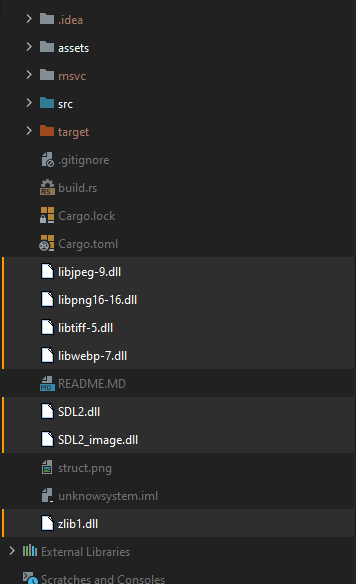
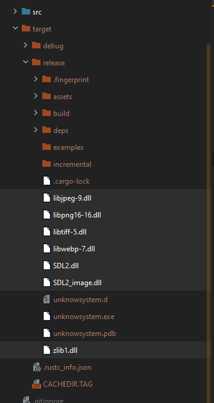

## Rust SDL2
 - [Depo](https://github.com/Rust-SDL2/rust-sdl2)
## Download SDL ZIP : 
 - [dev sdl](https://libsdl.org/download-2.0.php)
 - [other](https://www.libsdl.org/projects/)
 - [gfx](https://sourceforge.net/projects/sdl2gfx/)
## View other branches for more code :)
 - [branches](https://github.com/loicngr/rustsdl-basics/branches)

## Structure global

## Structure sdl lib

## Structure sdl release

